# Figma To Unity Importer

## Overall information
Tool that imports nodes from Figma into the Unity.
Before using I want u to notice, that the project is raw, and I can't promise you that I will develop it intensively.
Some features are not ready yet. Some features are impossible to quickly recreate in Unity.

## Contributing
You are welcome to contribute. And you are free to use this project for any purpose.

## Install
you can add `https://github.com/ManakhovN/FigmaToUnityImporter.git?path=/Assets/FigmaImporter` to Package Manager

## Usage
Firstly, you need to put FigmaImporter into your project.
Then new menu option will appear.
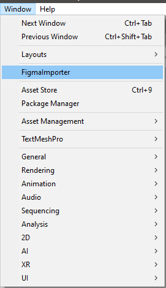

Now press OpenOauthUrl button.

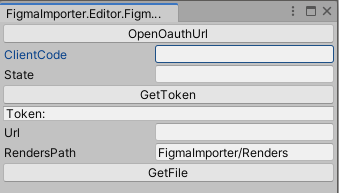

It will redirect you to the access allowance page. Press "Allow access there"

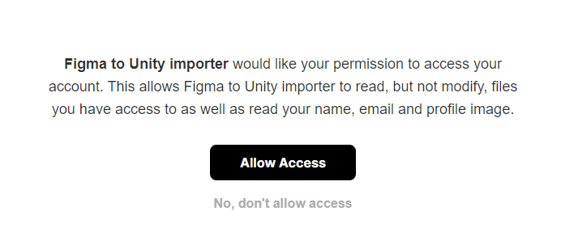

Then the callback page will be opened. Copy ClientCode and State into Figma Editor window. And press "GetToken" button. 

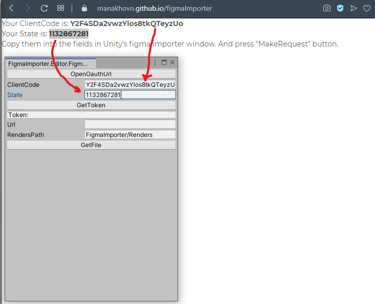

If token appeared, then you did everything right. If not, repeat the step with access allowance.

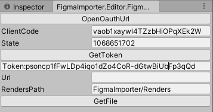

Now you can copy the node link, and put it in the URL field in unity.

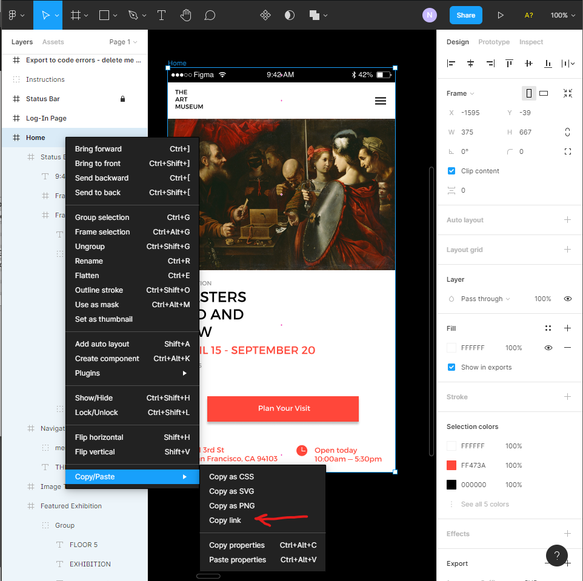

Now add Canvas to canvas field in the importer editor window.
And press the "Get Node Data" button. It will load all data about the node with it's children. Now you can choose the action for every child.
By default it will determine the nodes that it can try to generate. Others it will render. 
Also you can override Sprite, so it will put it instead of rendered node.
The actions are: 
- Generate - tries to generate node via UGUI. 
- Render - Loads render of the node via Figma API. 
- Transform - sets only transform for the generated object. 
- None - does nothing. 

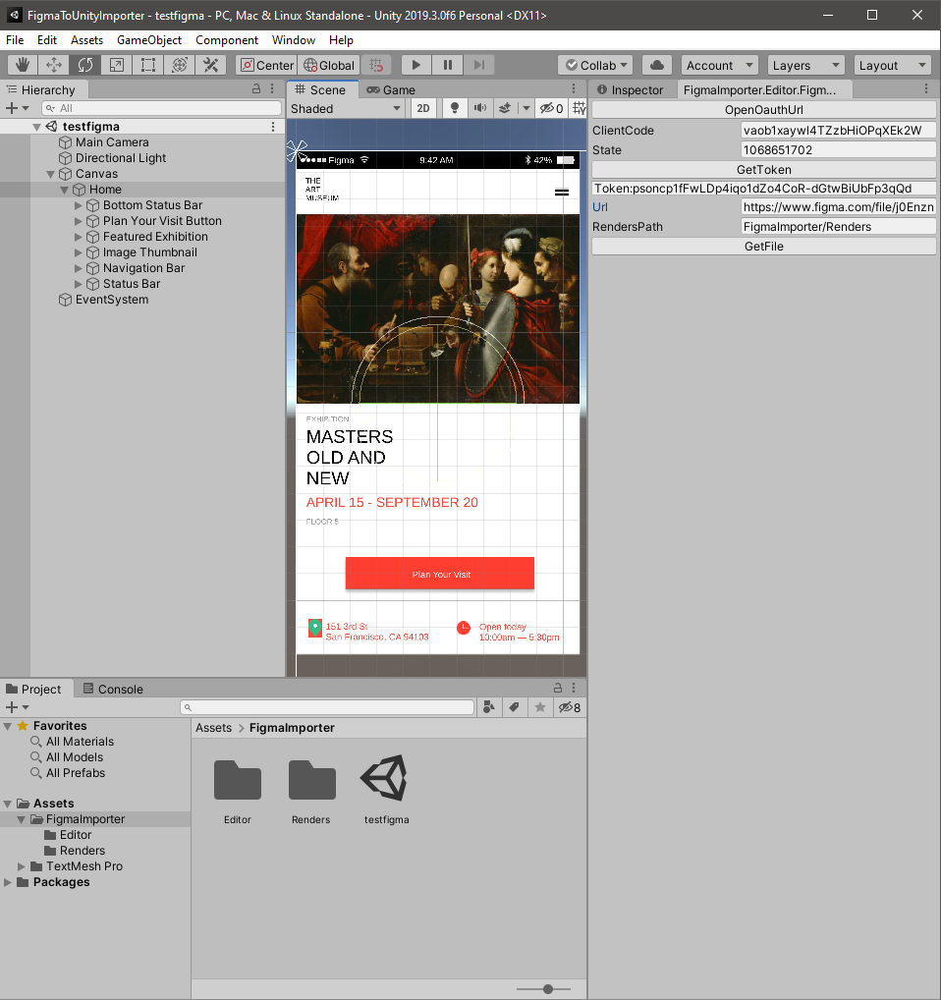

As you can see there are three additional buttons. That help you to change actions on nodes:
- To generate - it is default behaviour. Render nodes as raster. Generate nodes that has childs. Generate text nodes.
- To Transform - set action "Transform" to all nodes. It can be useful if you apply changes to existing object.
- To SVG - if you have installed Unity's Vector Graphics package it will try to load all images as svg.

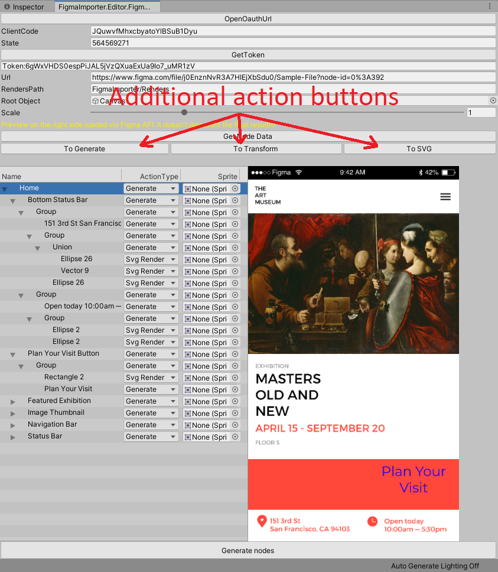
When you picked all actions. Press "Generate nodes" button. And it will try generating the node in referenced Canvas. That's all!

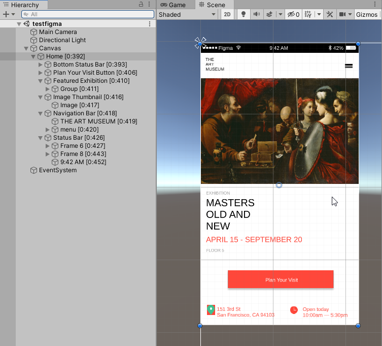

If you pick already existing object (previously generated node). You can set it as root object. And all changes will be applied to the created gameobjects. It finds appropriate gameobjects by their id's in name in squared braces like [0:329]
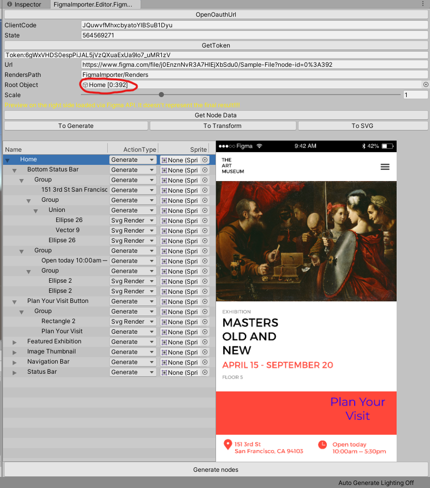

By the way, there is an option to scale objects and raster images by changing scale parameter. The maximum scale that you can get is x4. Figma doesnt allow to get bigger scale of rendered image.
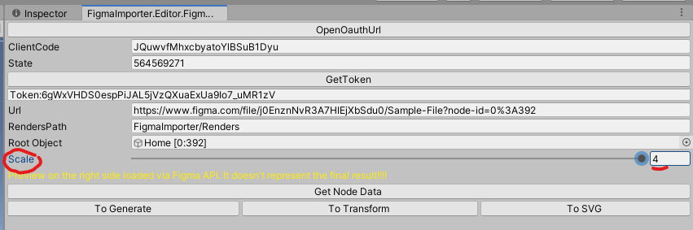

There is also one thing with Fonts.
If you got the error about Font. You should add it in FontLinks.asset scriptable object.

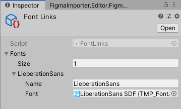

## Update 07.10.2021
Changed position calculating for nodes. Now it doesnt use tricky operations with parents chaniging.
Now if you choose existing object, instead of canvas, it will apply all changes to it without creating a new one.
Also added scale option.
Will test it and rewrite readme a little bit later.
##Update 21.11.2021
Some refactoring.
Added SVG support.